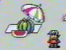

# Modern Communities

## Japanese Fan Sites

### Satellaview Heaven (bsx.seesaa.net)

{ align="right" width="200" }

**Maintainer:** Madick  
**Active:** January 2007 -- August 2016[^1]

A blog-style site covering a broad range of Satellaview topics including:
- SoundLink Games (5 posts)
- BS Original Games
- "Town Whose Name Was Stolen" content (3 posts)
- St.GIGA bankruptcy and WINJ rights transfer coverage
- St.GIGA original goods (whistle, watch with Satellaview/St.GIGA logos)
- Item introductions from BS-X[^2]

Madick also maintained the **Japanese Satellaview Wiki** at atwiki.jp/bsxx.[^3]

### Satellaview History Museum (www.f3.dion.ne.jp/~kameb/satella/)

**Maintainer:** Kameb  
**Active:** ~2000 -- 2008 (57 Wayback captures from 2001-2017)[^4]

One of the oldest surviving Satellaview fan sites. Tagline: *"This is a record of memories as a Satellaview player."*

Notable content includes:
- "Map of the Town Whose Name Was Stolen"
- "Super Famicom Hour Program Schedule" (updated as late as February 2008)
- "SoundLink Game List" (July 2000)
- "Data Save Pack Save Data" (March 2004)
- Comprehensive link collection[^5]

### Satellaview Memorial (www5.airnet.ne.jp/hiro-n/game/satella/memorial)

**Maintainer:** HIRO (also the SatellaOFF organizer)  
**Active:** Early 2000s

A Japanese fan site discussing the last days of the Satellaview, maintained by the organizer of the SatellaOFF events.[^6]

### Japanese Satellaview Wiki (atwiki.jp/bsxx)

**Creator:** Madick  
**Active:** ~2007 -- 2016

A collaborative community wiki with comprehensive structured content:
- Full game lists and broadcast schedules
- Personality program lists
- "Satellaview Complete History" page
- "Town Whose Name Was Stolen" detailed page
- Sound Link Game Timeline
- Hardware/peripheral information[^7]

The wiki describes the Satellaview's three content pillars:
1. Radio programs (featuring Tamori, Ayumi Hamasaki, Bakusho Mondai)
2. Downloadable original games and add-on data
3. Sound Link games (synchronized radio + gameplay)[^8]

{ align="right" width="200" }

### Mikarin's Pages

**Maintainer:** Mikarin  
**Active:** 2003 -- Present (site still up as of 2024)[^9]

Two personal sites:
- **Mikarin's Tekitou Page** (`f49.aaa.livedoor.jp/~mikarin`) -- domain redirected, content mostly lost
- **Mikarin BS Page** (`sound.jp/mikarin/bs.html`) -- hosts rare Satellaview audio files, though many are corrupted. Notable content includes "Satellaview BS Super Mario Collection Completion Campaign," event chronicles, and archived radio show audio.[^10]

The site warns: *"Due to server capacity issues, audio files may be corrupted or not playable."*

---

## English-Language Communities

### The English Satellaview Wiki (Fandom)

**Founder:** KiddoCabbusses (September 2009)[^11]  
**Status:** Still online (143 pages as of 2025)

The primary English-language wiki for Satellaview information, hosted on Fandom. Covers the system, games, community, and technical details.[^12]

### Satellablog (superfamicom.org/blog)

**Founder:** KiddoCabbusses (original blog: April 2008)  
**Current Maintainer:** danyl (2024-2026)

The longest-running English Satellaview news and preservation blog. Originally at Blogspot, moved to superfamicom.org in April 2009. After years of inactivity, the blog was revived in 2024 by danyl who now posts regular memory pack dumps and broadcast data research.[^13]

### BS Zelda Shrine (bszelda.zeldalegends.net)

**Founder:** Con (November 2, 1999)[^14]  
**Status:** Still online, last updated December 2020

One of the oldest English Satellaview pages on the internet. Covers all BS Zelda games and hosts a forum (now largely defunct). The site's Hall of Fame lists the community's key contributors.[^15]

---

## Broader Communities

### Elude Visibility (eludevisibility.org)

**Maintainer:** Matthew Callis  
**Status:** Active (updated as of 2026)

A professional-grade ROM dumping and preservation site with significant Satellaview content. Has released 50+ prototype dumps including significant Satellaview material.[^16]

### St.GIGA Forever (stgiga.jp)

**Status:** Defunct (domain now redirects to unrelated content; 92 Wayback captures from 2007-2020)

A memorial site for St.GIGA documenting the transition from St.GIGA to WINJ, the end of BS analog broadcasting (March 31, 2005), and WINJ's eventual suspension. Tagline: *"I'm here. I'm glad you're there. We are St.GIGA."*

WINJ was declared legally "bankrupt" (破綻) in November 2007 after failing to restart operations.[^17]

### SFC Mania (blog.goo.ne.jp/randnetdd)

**Maintainer:** randnetdd  
**Active:** ~2005 -- November 2010 (abandoned)

Focused on rare Super Famicom and Satellaview games with extensive original screenshots. Notable discoveries include:
- Proving Jupiter Corporation's official Tamori no Picross broadcast dates (Aug 6-Sep 2, 1995) were wrong, with VHS evidence of broadcasts from April 23, 1995 and June 8, 1995
- Identified 4 different title screens for Tamori no Picross
- Documented "TestData 10/24" -- a ROM naming mystery for Yuuko Anai no Houkago no Ousama
- Documented Magical Drop 2 JOQR Special Version[^18]

---

[^1]: [Satellaview Heaven](https://web.archive.org/web/*/bsx.seesaa.net/)
[^2]: [Satellaview Heaven](https://web.archive.org/web/*/bsx.seesaa.net/)
[^3]: [Japanese Satellaview Wiki](https://web.archive.org/web/*/www36.atwiki.jp/bsxx)
[^4]: [Satellaview History Museum](https://web.archive.org/web/*/www.f3.dion.ne.jp/~kameb/satella/satella.htm)
[^5]: [Satellaview History Museum](https://web.archive.org/web/*/www.f3.dion.ne.jp/~kameb/satella/satella.htm)
[^6]: [Satellaview Memorial](https://web.archive.org/web/*/www5.airnet.ne.jp/hiro-n/game/satella/memorial)
[^7]: [Japanese Satellaview Wiki](https://web.archive.org/web/*/www36.atwiki.jp/bsxx)
[^8]: [Japanese Satellaview Wiki](https://web.archive.org/web/*/www36.atwiki.jp/bsxx)
[^9]: [Mikarin BS page](https://web.archive.org/web/*/sound.jp/mikarin/bs.html)
[^10]: [Mikarin BS page](https://web.archive.org/web/*/sound.jp/mikarin/bs.html)
[^11]: [Satellablog - Working on a Wiki](https://superfamicom.org/blog/2009/09/working-on-a-wiki)
[^12]: [The English Satellaview Wiki](https://satellaview.fandom.com/)
[^13]: [Satellablog](https://superfamicom.org/blog/)
[^14]: [BS Zelda Shrine](http://bszelda.zeldalegends.net/)
[^15]: [BS Zelda Shrine - Hall of Fame](http://bszelda.zeldalegends.net/)
[^16]: [Elude Visibility](https://eludevisibility.org/)
[^17]: [St.GIGA Forever](https://web.archive.org/web/*/www.stgiga.jp/)
[^18]: [SFC Mania](https://web.archive.org/web/*/blog.goo.ne.jp/randnetdd)
