# Image Gallery

A comprehensive collection of Satellaview-related images archived in this repository.

---

## Satellaview Hardware

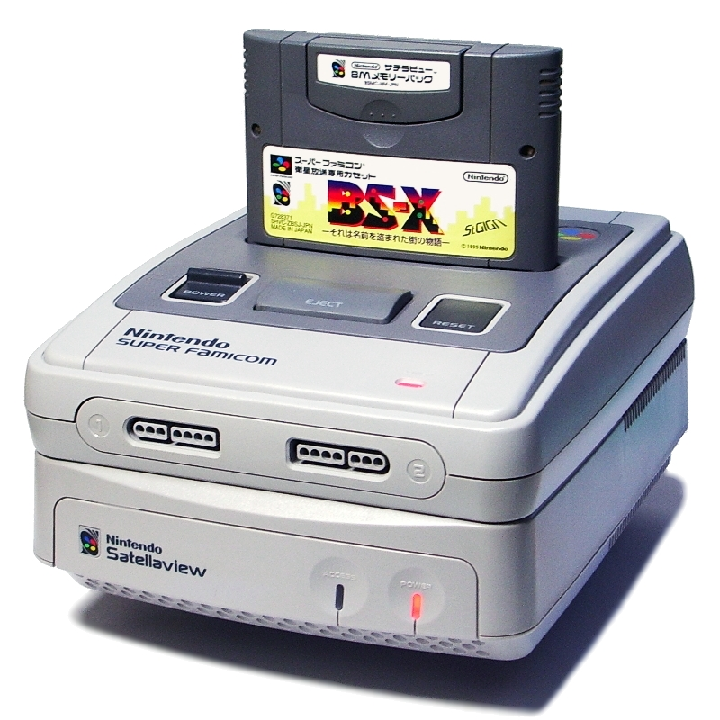{ width="250" }
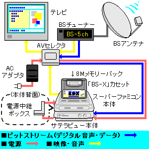{ width="250" }
{ width="250" }

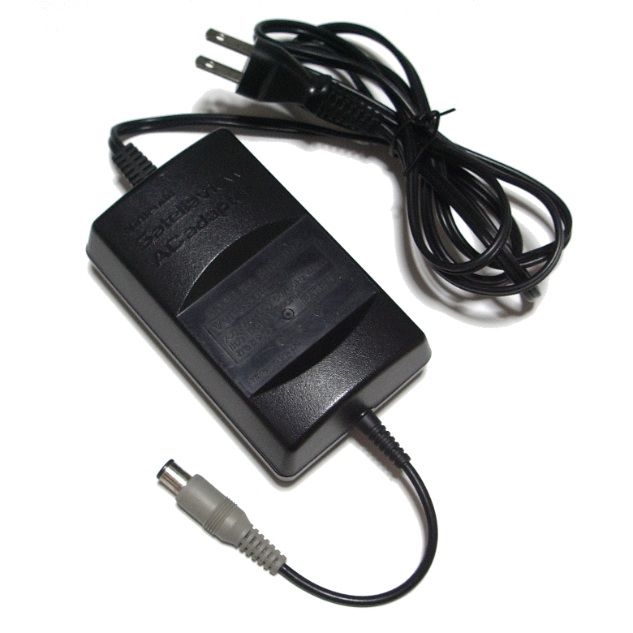{ width="250" }
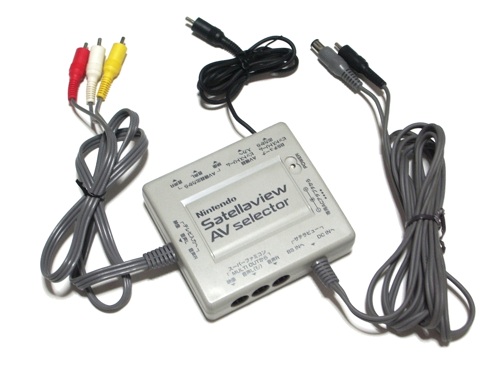{ width="250" }
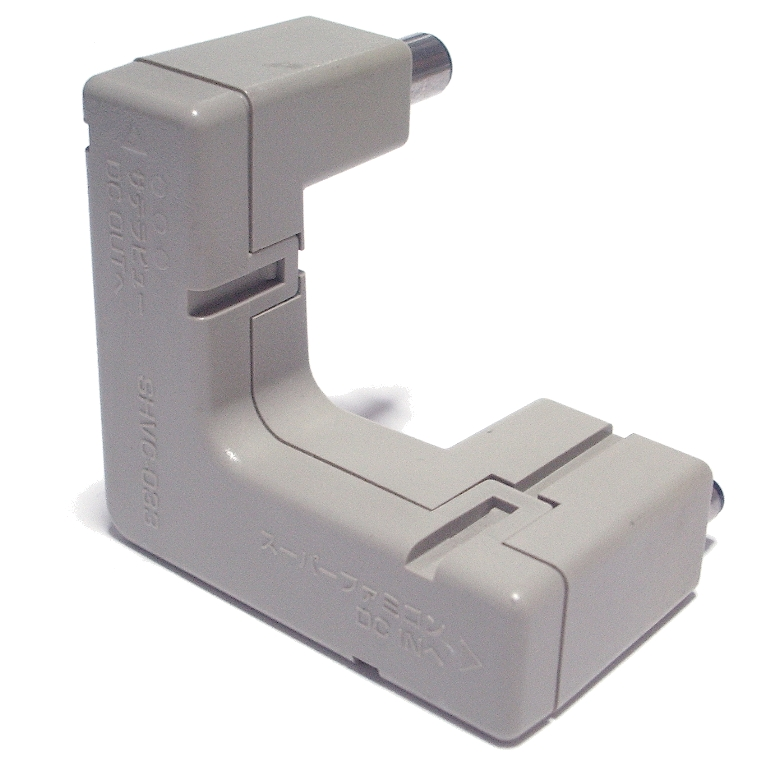{ width="250" }

---

## St.GIGA

{ width="200" }
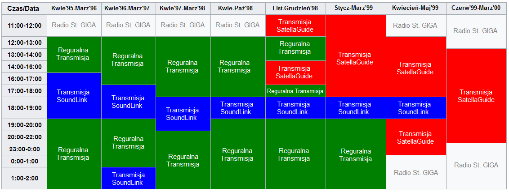{ width="300" }

### St.GIGA Merchandise

{ width="150" }
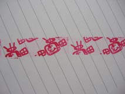{ width="150" }
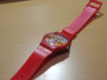{ width="150" }
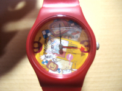{ width="150" }

### Broadcast Screenshots

{ width="200" }
{ width="200" }
{ width="200" }
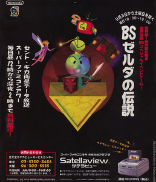{ width="200" }

---

## BS-X Town Map & Museum

{ width="300" }
{ width="250" }

---

## BS Zelda Series

### Map 1 Screenshots

{ width="200" }
{ width="200" }
{ width="200" }
{ width="200" }
{ width="200" }
{ width="200" }
{ width="200" }
{ width="200" }

### Player Sprites

{ width="100" }
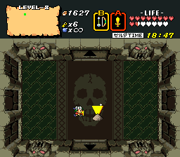{ width="100" }
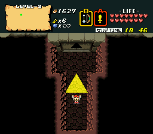{ width="100" }
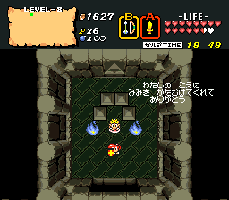{ width="100" }

### Beta Content

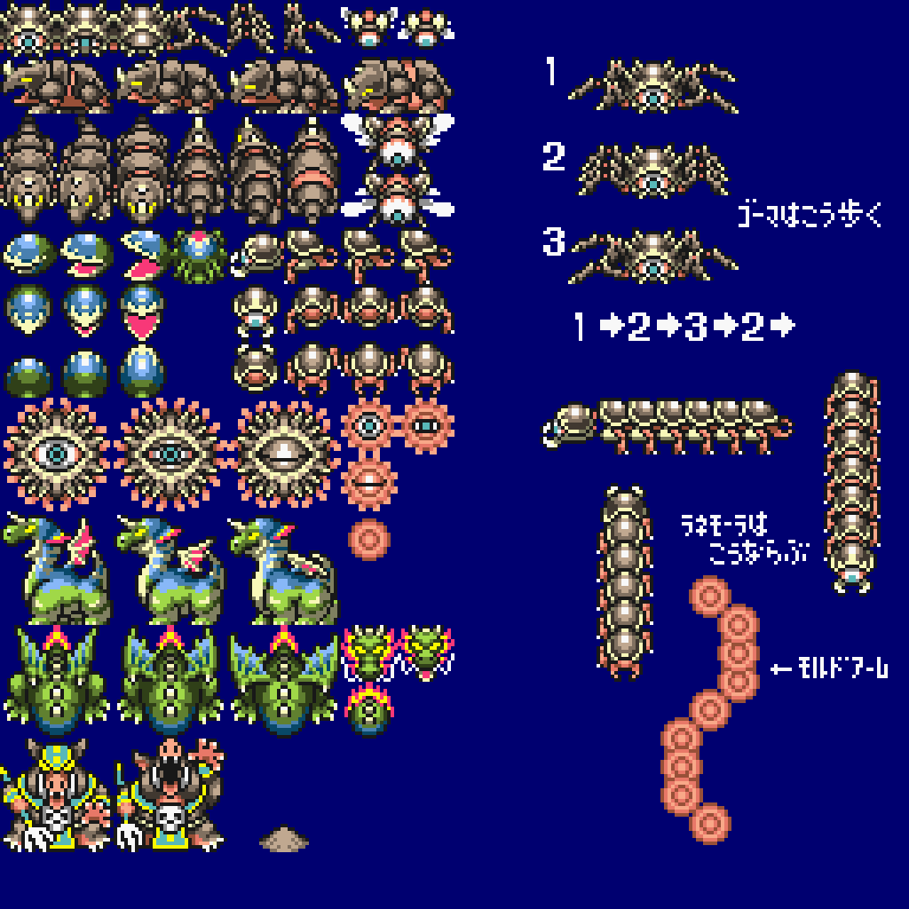{ width="200" }
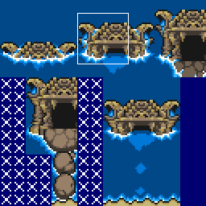{ width="200" }
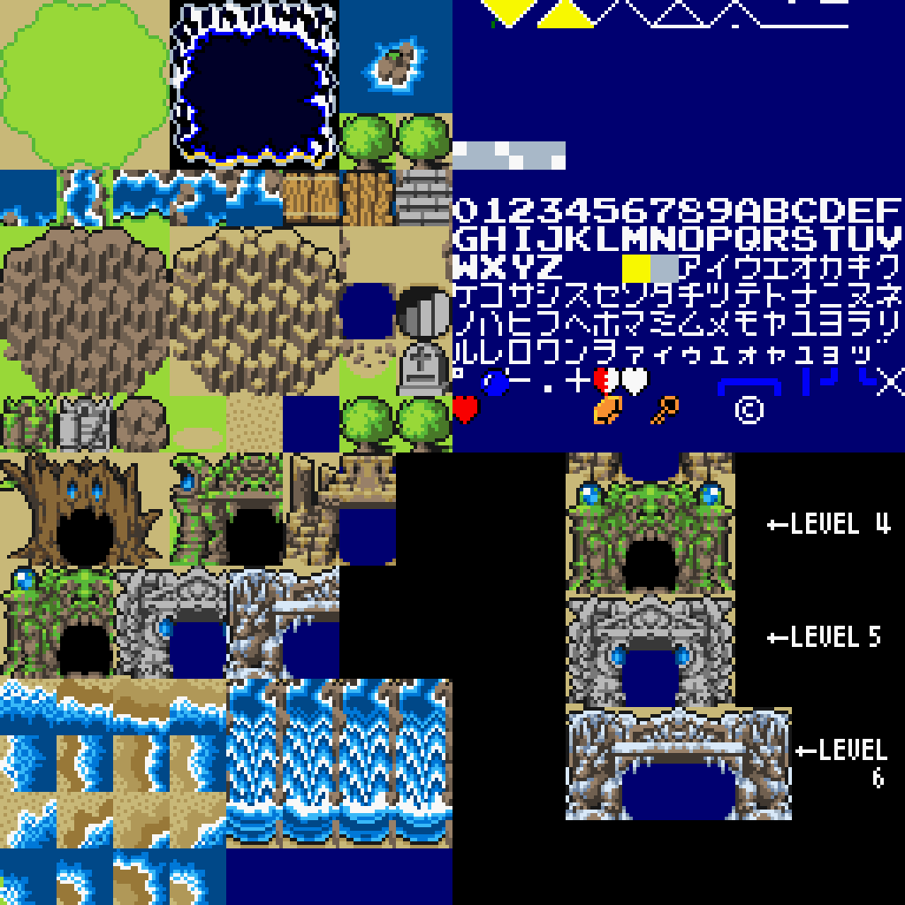{ width="200" }
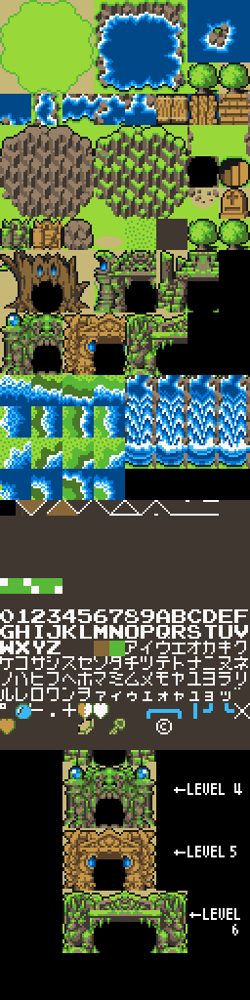{ width="200" }

### Cover and Promo

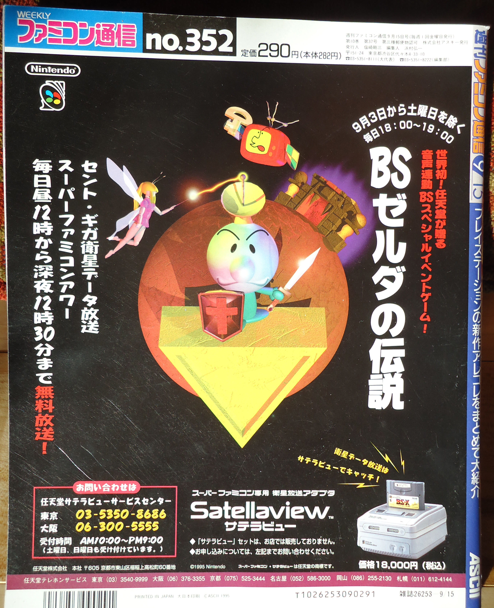{ width="200" }
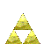{ width="200" }
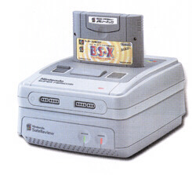{ width="200" }
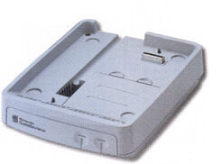{ width="200" }
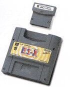{ width="200" }

### Map 2 (BS Zelda 2)

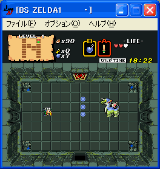{ width="200" }
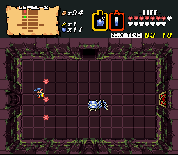{ width="200" }
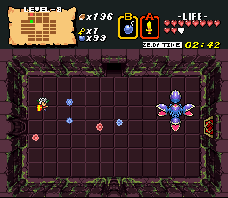{ width="200" }
{ width="200" }
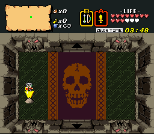{ width="200" }
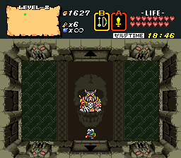{ width="200" }
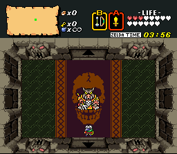{ width="200" }

### Ancient Stone Tablets

{ width="200" }
{ width="200" }
{ width="200" }
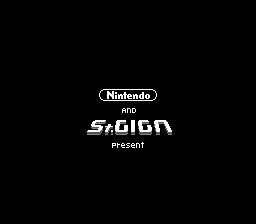{ width="200" }
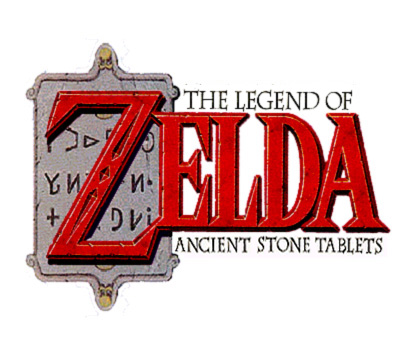{ width="200" }
{ width="200" }

#### AST English Title

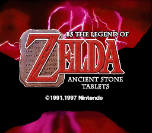{ width="200" }
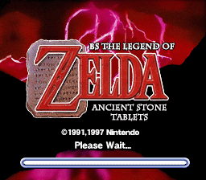{ width="200" }
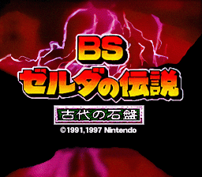{ width="200" }
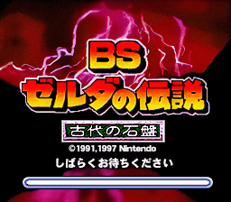{ width="200" }

#### AST Art

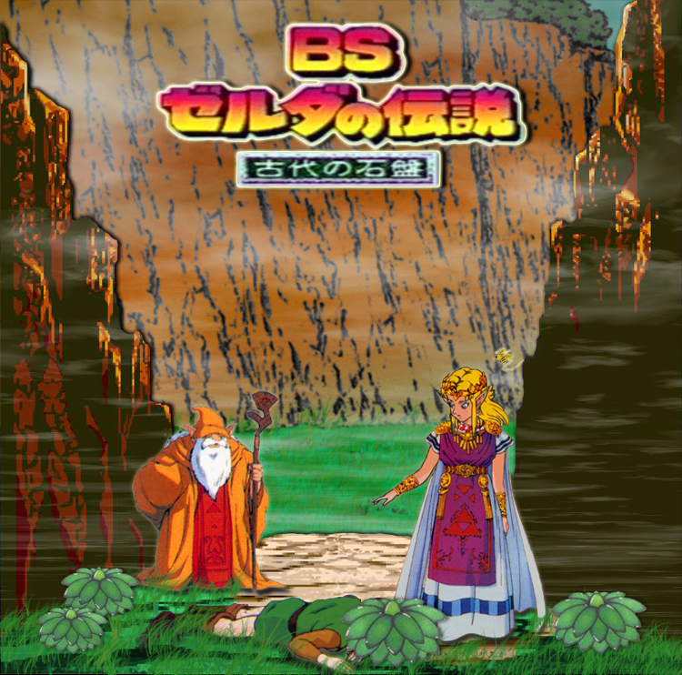{ width="200" }
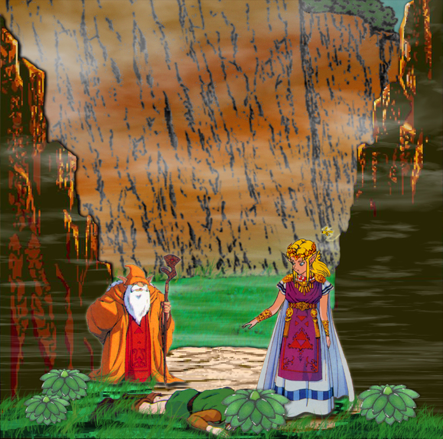{ width="200" }
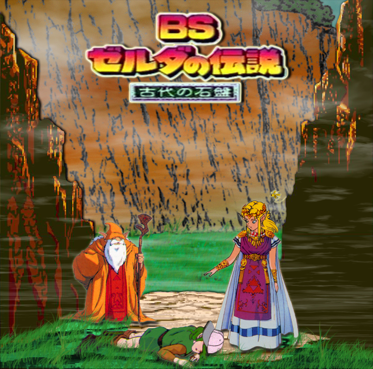{ width="200" }
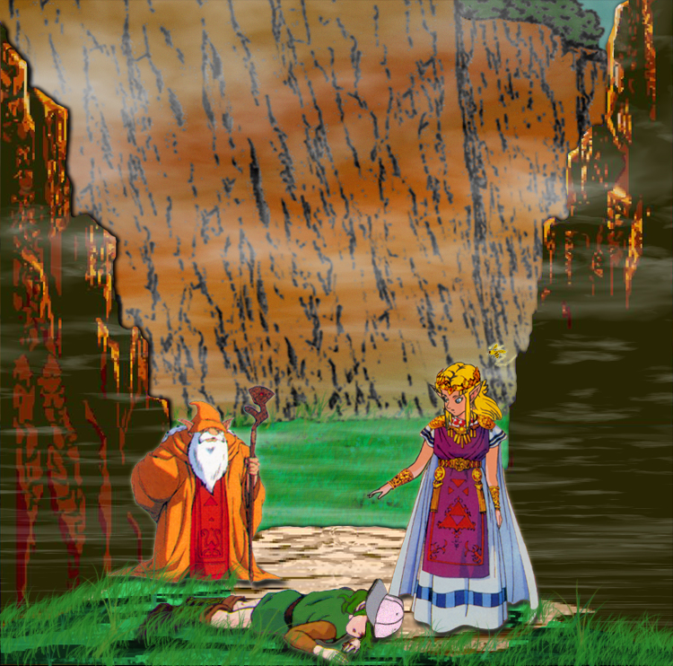{ width="200" }

#### AST Screenshots

{ width="200" }
{ width="200" }
{ width="200" }
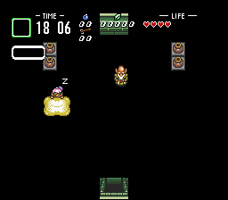{ width="200" }
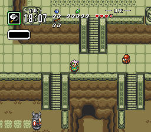{ width="200" }
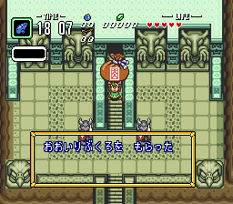{ width="200" }
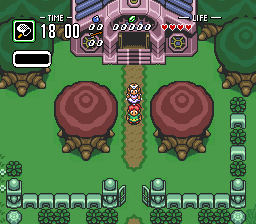{ width="200" }
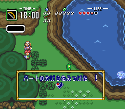{ width="200" }

#### AST Dungeon Screenshots

{ width="200" }
{ width="200" }
{ width="200" }
{ width="200" }
{ width="200" }
{ width="200" }
{ width="200" }
{ width="200" }
{ width="200" }
{ width="200" }
{ width="200" }
{ width="200" }

#### AST Endings

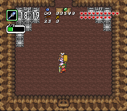{ width="200" }
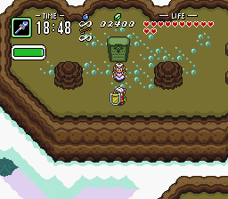{ width="200" }
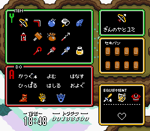{ width="200" }
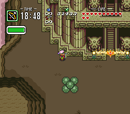{ width="200" }
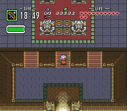{ width="200" }
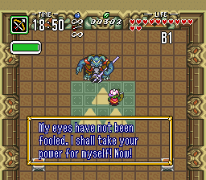{ width="200" }
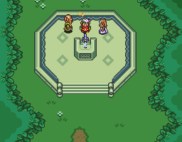{ width="200" }

#### Kamigami no Triforce

{ width="200" }
{ width="200" }
{ width="200" }
{ width="200" }
{ width="200" }
{ width="200" }
{ width="200" }

#### Technical

{ width="200" }
{ width="200" }
{ width="200" }
{ width="200" }
{ width="200" }

---

## BS SimCity

{ width="200" }
{ width="200" }
{ width="200" }
{ width="200" }
{ width="200" }
{ width="200" }
{ width="200" }
{ width="200" }
{ width="200" }
{ width="200" }
{ width="200" }
{ width="200" }
{ width="200" }
{ width="200" }

---

## BS-X Items

{ width="150" }
{ width="150" }
{ width="150" }
{ width="150" }
{ width="150" }
{ width="150" }
{ width="150" }
{ width="150" }
{ width="150" }
{ width="150" }
{ width="150" }
{ width="150" }
{ width="150" }
{ width="150" }
{ width="150" }
{ width="150" }
{ width="150" }
{ width="150" }
{ width="150" }
{ width="150" }
{ width="150" }
{ width="150" }
{ width="150" }
{ width="150" }
{ width="150" }

---

## SatellaOFF Community Events

### Event Photos

{ width="250" }
{ width="250" }
{ width="250" }
{ width="250" }
{ width="250" }

### DDR & Arcade

{ width="250" }
{ width="250" }
{ width="250" }
{ width="250" }
{ width="250" }

### Participants

{ width="200" }
{ width="200" }
{ width="200" }
{ width="200" }
{ width="200" }
{ width="200" }
{ width="200" }

### Signs & Prints

{ width="250" }
{ width="250" }
{ width="250" }
{ width="250" }
{ width="250" }
{ width="250" }

### Games

{ width="200" }
{ width="200" }
{ width="200" }
{ width="200" }

### GIFs

{ width="200" }
{ width="200" }
{ width="200" }

---

## Satellaview Heaven

### Site Assets

{ width="150" }
{ width="50" }

### Bass Tsuri

{ width="200" }
{ width="200" }
{ width="200" }

### Mighty P

{ width="150" }
{ width="150" }
{ width="150" }
{ width="150" }
{ width="150" }
{ width="150" }
{ width="150" }
{ width="150" }
{ width="150" }
{ width="150" }
{ width="150" }
{ width="150" }
{ width="150" }
{ width="150" }
{ width="150" }
{ width="150" }
{ width="150" }
{ width="150" }
{ width="150" }
{ width="150" }
{ width="150" }
{ width="150" }
{ width="150" }
{ width="150" }
{ width="150" }
{ width="150" }
{ width="150" }
{ width="150" }
{ width="150" }
{ width="150" }
{ width="150" }
{ width="150" }
{ width="150" }
{ width="150" }
{ width="150" }
{ width="150" }
{ width="150" }

### Piko Piko

{ width="200" }
{ width="200" }
{ width="200" }
{ width="200" }
{ width="200" }
{ width="200" }
{ width="200" }
{ width="200" }
{ width="200" }

### Onion

{ width="200" }
{ width="200" }

### SatellaQuiz

{ width="300" }

### Disc DB

{ width="200" }
{ width="200" }
{ width="200" }
{ width="200" }
{ width="200" }
{ width="200" }

---

## BS Shin Onigashima

{ width="300" }

---

## Other SNES / Satellaview Misc

{ width="250" }
{ width="250" }
{ width="250" }

---

*This gallery contains all media archived as part of the SatellaStory project. Images are sourced from Satellaview Heaven, BS Zelda Shrine, Satellaview History Museum, SatellaOFF event pages, and Wikimedia Commons.*
