# Complete Game Catalog

A visual catalog of every known Satellaview broadcast game, with screenshots where available.

---

## The Legend of Zelda Series

### BS Zelda no Densetsu (Map 1 & 2)

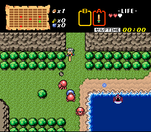{ width="200" }
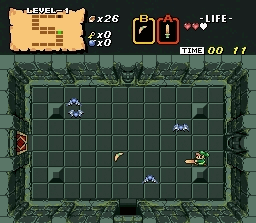{ width="200" }
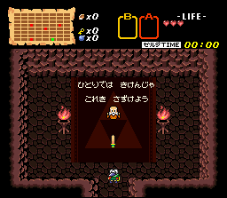{ width="200" }
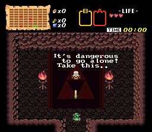{ width="200" }
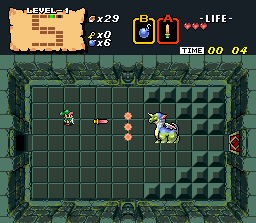{ width="200" }
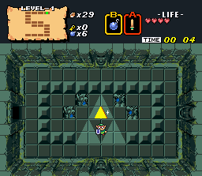{ width="200" }
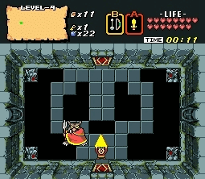{ width="200" }
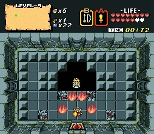{ width="200" }

- **Type:** Downloadable (SoundLink for Map 2)
- **Broadcast:** 1996 (weeks 1-4 each)
- **Status:** [Fully restored](bs-zelda.md) — playable in emulation
- **Note:** Dungeon names spell "St.GIGA" (Map 1) and "NiNtENDO" (Map 2)

---

### BS Zelda: Inishie no Sekiban (Ancient Stone Tablets)

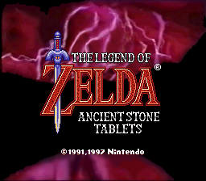{ width="200" }
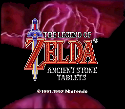{ width="200" }
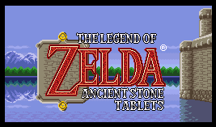{ width="200" }
{ width="200" }

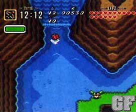{ width="200" }
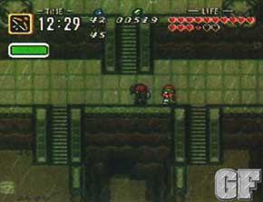{ width="200" }
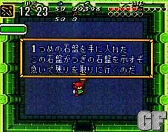{ width="200" }

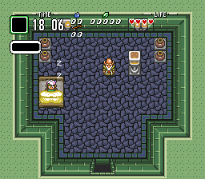{ width="150" }
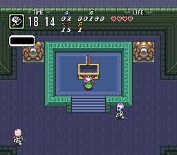{ width="150" }
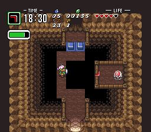{ width="150" }
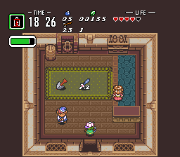{ width="150" }
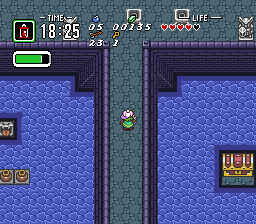{ width="150" }
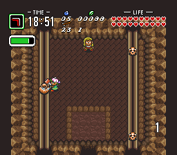{ width="150" }
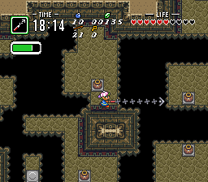{ width="150" }
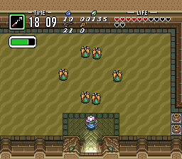{ width="150" }
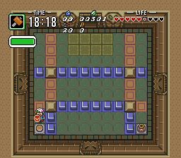{ width="150" }
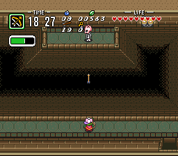{ width="150" }
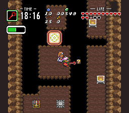{ width="150" }
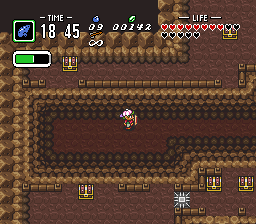{ width="150" }

- **Type:** SoundLink (with voice acting)
- **Broadcast:** 1997-1998 (4 weeks)
- **Status:** [Partially restored](bs-zelda.md) — first Zelda with voice acting
- **Broadcast screenshot:**

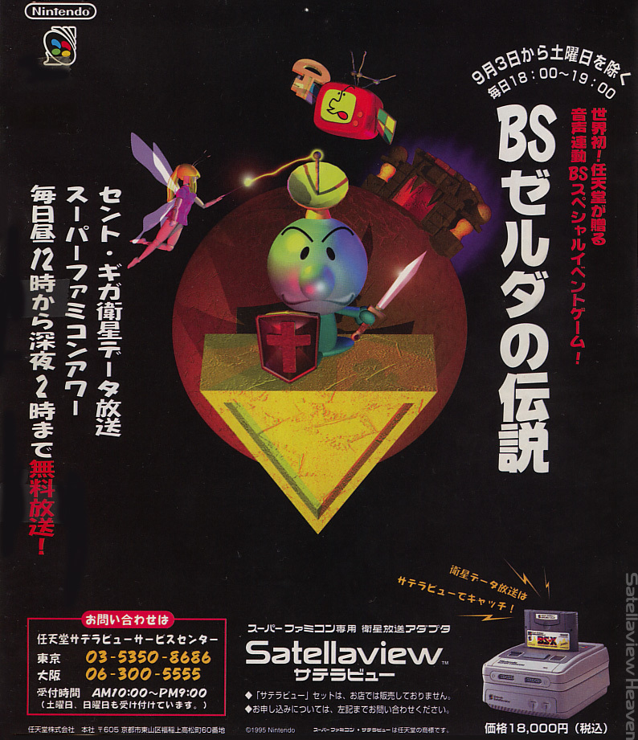{ width="200" }

---

## BS Fire Emblem: Akaneia Senki

{ width="200" }

- **Type:** SoundLink (radio drama + tactical RPG)
- **Broadcast:** Sep 28 – Oct 19, 1997 (4 episodes)
- **Status:** [Restored (DS re-release)](bs-fire-emblem.md)
- **Screenshots:** None available in archive

[Full page & cast list →](bs-fire-emblem.md)

---

## BS Tantei Club: Yuki ni Kieru Kako

- **Type:** SoundLink (mystery adventure)
- **Broadcast:** 1997 (3+ weeks)
- **Status:** [Project Gam restoration](bs-tantei-club.md)
- **Screenshots:** None available in archive

[Full page →](bs-tantei-club.md)

---

## BS Dragon Quest

- **Type:** Downloadable
- **Broadcast:** 1996 (4 weeks, Feb-Mar)
- **Status:** [Debug ROM leaked](bs-dragon-quest.md) — unique combined-week build
- **Screenshots:** None available in archive

[Full page →](bs-dragon-quest.md)

---

## BS SimCity: Machi Tsukuri Taikai

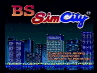{ width="200" }
{ width="200" }
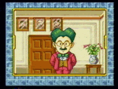{ width="200" }
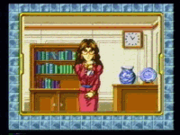{ width="200" }
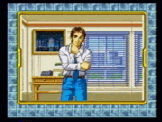{ width="200" }
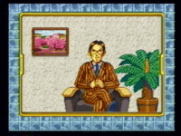{ width="200" }
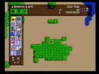{ width="200" }
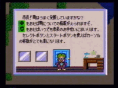{ width="200" }
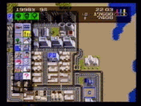{ width="200" }
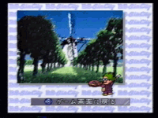{ width="200" }
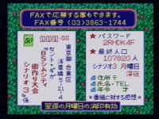{ width="200" }
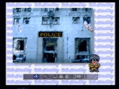{ width="200" }
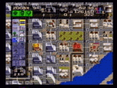{ width="200" }
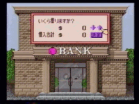{ width="200" }

- **Type:** Downloadable (city-building competition)
- **Broadcast:** 1995
- **Status:** [Documented by Satellaview Heaven](other-broadcast-games.md)

---

## BS Super Mario Collection (BS Mario: Around the World)

- **Type:** Downloadable (Time Attack)
- **Broadcast:** 1995 (4 weeks), rebroadcast 1997-1998
- **Status:** [Restored](other-broadcast-games.md)

**Broadcast screenshot:**

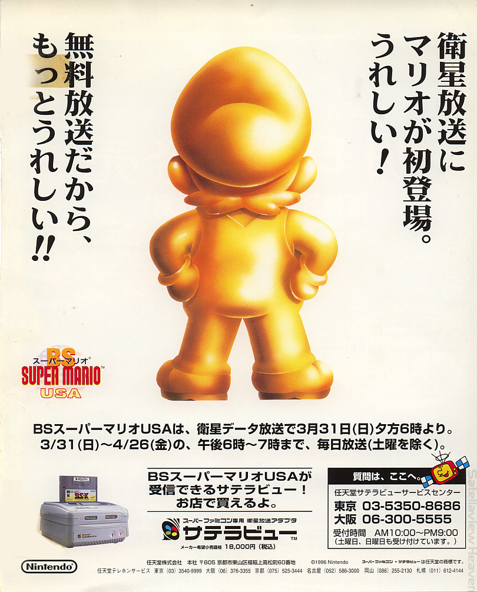{ width="200" }

---

## BS F-Zero Grand Prix / BS F-Zero 2

- **Type:** SoundLink
- **Broadcast:** 1997
- **Status:** [Partially restored](other-broadcast-games.md); BS F-Zero 2 playable at SatellaOFF
- **Screenshots:** None available in archive

---

## Excitebike: BunBun Mario Battle Stadium

{ width="150" }

- **Type:** SoundLink (multiplayer racing)
- **Broadcast:** May-Nov 1997 (4+ weeks)
- **Status:** [Patched by d4s](other-broadcast-games.md) — playable without satellite input

---

## BS Super Mario USA Power Challenge

- **Type:** SoundLink
- **Broadcast:** Mar-May 1996 (4 weeks)
- **Status:** [Partially restored](other-broadcast-games.md)
- **Screenshots:** None available in archive

---

## Tamori no Picross

- **Type:** Downloadable (puzzle)
- **Broadcast:** Apr-Sep 1995 (4+ title screens identified)
- **Status:** [Preserved](other-broadcast-games.md) — Jupiter Corp dates contradicted by VHS evidence

---

## Kirby no Omocha Hako (Kirby's Toy Box)

- **Type:** Downloadable (minigame collection)
- **Broadcast:** 1996
- **Status:** [Preserved by Elude Visibility](other-broadcast-games.md)
- **Screenshots:** None available in archive

---

## Satella-Q / SatellaQuiz

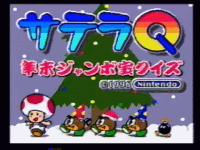{ width="250" }

- **Type:** Quiz (live broadcast)
- **Broadcast:** 1995-1999 (many editions)
- **Status:** [Documented](other-broadcast-games.md) — scores recorded at SatellaOFF

---

## BS Shin Onigashima

{ width="250" }

- **Type:** SoundLink
- **Broadcast:** Unknown
- **Status:** Music restoration attempted from VHS recordings

---

## Additional SoundLink & Downloadable Games

These games are documented in broadcast schedules but few details survive:

### BS Shiren the Wanderer: Save Surara

- **Type:** SoundLink
- **Broadcast:** May-Jun 1996 (4 weeks)
- **Status:** Documented at Satellaview History Museum

### Bass Tsuri No.1

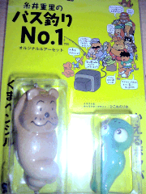{ width="200" }
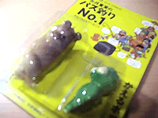{ width="200" }
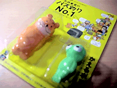{ width="200" }

- **Type:** SoundLink (fishing tournament)
- **Broadcast:** Apr-Aug 1997 (multiple tournaments)
- **Status:** VTR-confirmed by Satellaview History Museum

### Mightypockets (Mighty P)

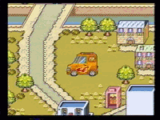{ width="150" }
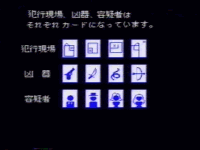{ width="150" }
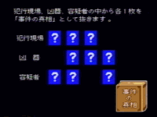{ width="150" }
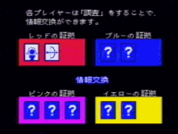{ width="150" }
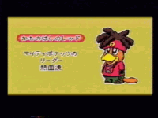{ width="150" }
{ width="150" }
{ width="150" }
{ width="150" }
{ width="150" }
{ width="150" }
{ width="150" }
{ width="150" }
{ width="150" }
{ width="150" }
{ width="150" }
{ width="150" }

- **Type:** Downloadable (?)
- **Broadcast:** Unknown
- **Status:** Screenshots preserved from Satellaview Heaven

### Piko Piko Pirates

{ width="200" }
{ width="200" }
{ width="200" }
{ width="200" }
{ width="200" }
{ width="200" }
{ width="200" }
{ width="200" }
{ width="200" }

- **Type:** Downloadable (?)
- **Broadcast:** Unknown
- **Status:** Screenshots preserved from Satellaview Heaven

### BS Mario: Board Walk to the Palace

- **Type:** SoundLink
- **Broadcast:** Dec 1995 (4 weeks)
- **Status:** Documented at Satellaview History Museum

### BS Spriggan Powered

- **Type:** SoundLink
- **Broadcast:** May-Jul 1996
- **Status:** Documented

### BS Treasure Hunter

- **Type:** SoundLink
- **Broadcast:** Sep 1996 (4 weeks)
- **Status:** Documented

### BS Shioh-Gi

- **Type:** SoundLink
- **Broadcast:** Sep-Oct 1996 (4 weeks)
- **Status:** Documented

### Sound Journal: Pop & Graphic Since 1980

- **Type:** SoundLink (music/magazine)
- **Broadcast:** Oct-Nov 1996 (6 episodes)
- **Status:** Documented

### BS Teteru Moon: Grand Prix

- **Type:** SoundLink
- **Broadcast:** Dec 1996 – Jan 1997 (4 weeks)
- **Status:** Documented, rebroadcast Aug 1997

### BS Nitchie Tsuu March

- **Type:** SoundLink
- **Broadcast:** Jan-Feb 1997 (2 weeks)
- **Status:** Documented

### BS Sampei: Fun Fishing Memory

- **Type:** SoundLink
- **Broadcast:** Feb 1997 (3 weeks)
- **Status:** Documented

### BS Ihatou Story

- **Type:** SoundLink
- **Broadcast:** Mar 1997 (4 weeks)
- **Status:** Documented

### San Goku Shi no Bouei: Star Pirates

- **Type:** SoundLink
- **Broadcast:** Jun-Sep 1997 (4+ weeks)
- **Status:** Documented

### SatellaWalker

- **Type:** SoundLink (Satebô adventure)
- **Broadcast:** Jul 1997
- **Status:** Interactive mascot adventure game

### Dramatic Sound Witch (Blue & Power)

- **Type:** SoundLink
- **Broadcast:** Sep 1997
- **Status:** Documented

### BS Bokujou Monogatari (Perfect?!)

- **Type:** SoundLink
- **Broadcast:** Mar 1998 (2 weeks)
- **Status:** Documented

### BS Mario Collection 2 (4 weeks)

- **Type:** Downloadable
- **Broadcast:** Dec 1997 – Jan 1998 (4 weeks)
- **Status:** Documented

### All Japan Super Bombliss Cup '95 + Wai Wai de Pon

- **Type:** SoundLink (puzzle competition)
- **Broadcast:** Oct-Nov 1995
- **Status:** Documented at Satellaview History Museum

### Wai Wai de Pon (Spring Special + Specials)

- **Type:** SoundLink (panel puzzle)
- **Broadcast:** Nov-Dec 1995, Mar 1996
- **Status:** Nintendo character panel-matching game; documented at Satellaview History Museum

### BS Kirby Ball

- **Type:** SoundLink (breakout/Arkanoid)
- **Broadcast:** Aug 1996
- **Status:** Kirby-themed breakout game; distinct from Kirby no Omocha Hako

### Takaru Fantasy

- **Type:** SoundLink
- **Broadcast:** May-Jul 1996 (paired with BS Spriggan Powered)
- **Status:** Documented at Satellaview History Museum

### Satellaview Grand Prix '96 (Ishin Brothers Cup)

- **Type:** Event (live competition)
- **Broadcast:** Sep 1, 1996
- **Status:** Documented at Satellaview History Museum

### BS Quiz: Waku Waku San

- **Type:** Quiz (SoundLink)
- **Broadcast:** Jun 1997, Nov-Dec 1997 (2-week runs)
- **Status:** Quiz game documented at Satellaview History Museum

### Mamono to Issho

- **Type:** SoundLink (Pikmin-like?)
- **Broadcast:** Jul 1997, Dec 1997
- **Status:** Likely lost; described as "Pikmin-like" by Kameb; documented at Satellaview History Museum

### Satellaview Grand Prix 2: Mine + Live

- **Type:** Event (live competition)
- **Broadcast:** Jan 25-31, 1998
- **Status:** Documented at Satellaview History Museum

### SatellaWalker 2

- **Type:** SoundLink (Satebô adventure)
- **Broadcast:** Feb 15-28, 1998
- **Status:** Sequel to SatellaWalker; documented at Satellaview History Museum

### Sound Journal For Lovers

- **Type:** SoundLink (music/magazine)
- **Broadcast:** Feb 8-14, 1998 (2 weeks)
- **Status:** Valentine's special; documented at Satellaview History Museum

---

## Disc-Based Media (Satellaview-Tsushin Magazine)

Published by St.GIGA, these disc-based magazines contained game data, music, and articles:

{ width="150" }
{ width="150" }
{ width="150" }
{ width="150" }
{ width="150" }
{ width="150" }

---

## Complete Broadcast Timeline

For every known broadcast with exact dates, see the [SoundLink Broadcast List](../research/broadcast-data.md#complete-soundlink-broadcast-list-satellaview-history-museum) compiled from the Satellaview History Museum.

---

*Games without available screenshots are noted. If you have screenshots or recordings of any missing games, please contribute!*
