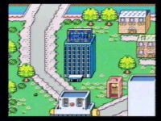
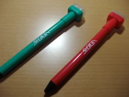
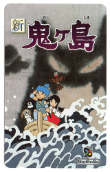

# Other Broadcast Games

## BS Dragon Quest

The **BS Dragon Quest** game was a Satellaview broadcast that featured multiple episodes of Dragon Quest-themed content. It is notable primarily because a **unique debug ROM** exists containing all 4 weeks combined with an episode-select menu and a valid BS-X checksum. This ROM was part of the stash leaked via BS-X Cult/Pachuka from ROMar.[^1]

The debug ROM is unusual because:
- It has a valid BS-X checksum (unlike most hacks or modified ROMs)
- It was NOT modified for emulator compatibility
- Its origin suggests it may have been an internal development build[^2]

## BS Super Mario Collection

A Satellaview port of Super Mario All-Stars featuring time-attack challenges and score competition. Players could download the game and compete for high scores during broadcast periods.[^3]

## BS F-Zero Grand Prix / BS F-Zero 2

**BS F-Zero Grand Prix** featured Ace, King, and Queen League configurations. **BS F-Zero 2** was a SoundLink game that was played by the SatellaOFF group during their March 1999 meetup. Full documentation of the league structure was provided by the Satellablog.[^4]

## Kirby no Omocha Hako (Kirby's Toy Box)

A collection of Kirby-themed minigames broadcast for the Satellaview, including:
- **Circular Ball** (pinball)
- **Cannon Ball**
- **Pachinko**
- **Arrange Ball**

Preserved by **Matthew Callis** and **Frank Cifaldi** who raised funds to win 4 cartridges at auction (¥85,500 / ~$813), later dumped and covered by Ars Technica and Nintendo Life.[^5]

## Tamori no Picross

Developed by **Jupiter Corporation** and published by Nintendo. A Picross (nonogram) puzzle game hosted by the famous Japanese television personality **Tamori** (Kazuyoshi Morita). Broadcast from April to September 1995.[^6]

**Date controversy:** Jupiter's official page states the broadcast was August 6 - September 2, 1995. However, **SFC Mania** (randnetdd) investigated this using original VHS recordings and proved this was incorrect:[^7]

- VHS evidence shows broadcasts on **April 23, 1995** (Satellaview launch day) and **June 8, 1995**, predating Jupiter's claimed dates
- SFC Mania identified **4 different title screens** for the game, suggesting multiple broadcast periods or versions
- The April 23 broadcast lacked the "Obake" and "Yasashii" Picross modes that appeared in later versions
- The earliest known VHS recording from April 23, 1995 features only 45 puzzles and different BGM
- Later recordings show 60 puzzles, new BGMs, and different screen layouts
- SFC Mania's conclusion: "Jupiter's data absolutely has mistakes" -- the actual broadcast period was longer and started earlier than officially documented

The game featured:
- **Normal Picross**, **Obake (Ghost) Picross** (time-limited), and **Yasashii (Easy) Picross** modes
- **Tamori's character** provided voice commentary during gameplay
- **Comic strip illustrations** by artist "Yoshida Senpai" were submitted by viewers and featured in the game
- A **"Tamori's Happy Set"** pen was given as a prize to winners of the picross competitions

SFC Mania also noted the game's BGM was very similar to standard Mario BGM but with slight differences in pitch and arrangement, and that the game lacked the extra hidden content found in the retail Mario no Picross.

## BS Tantei Club: Yuki ni Kieru Kako

A SoundLink mystery adventure game. A fan project called **"Project Gam"** was formed to restore this game after the service ended. Music restoration attempts were also made from VHS recordings.[^8]

## BS SimCity: Machi Tsukuri Taikai

{ align="left" width="250" }

A Satellaview version of SimCity where players could compete in city-building competitions. Documented by Satellaview Heaven with screenshots and gameplay descriptions.[^9]

## Excitebike: BunBun Mario Battle Stadium

{ align="right" width="200" }

A SoundLink multiplayer version of Excitebike featuring Mario-themed racing. **d4s** released a patch in 2006 that removed the SoundLink requirement and made the game playable without satellite input.[^10]

## Satella-Q

A quiz game broadcast as part of the Satellaview programming. During the SatellaOFF events, the group played a SatellaQuiz session with scores ranging from 48 to 75 points (human) vs. the NPC's 232/500.[^11]

## BS Shin Onigashima

{ align="left" width="250" }

A Satellaview game in the Onigashima series. Music restoration from VHS recordings was attempted.[^12]

---

[^1]: [Satellablog - BS Dragon Quest](https://superfamicom.org/blog/2010/06/so-whats-up-with-the-bs-dragon-quest-rom-anyway)
[^2]: [Satellablog - Digging into the history](https://web.archive.org/web/200812/http://satellablog.blogspot.com/2008/12/digging-into-history-of-satellaview.html)
[^3]: [Japanese Satellaview Wiki](https://web.archive.org/web/*/http://www36.atwiki.jp/bsxx)
[^4]: [Satellablog - BS F-Zero GP](https://superfamicom.org/blog/)
[^5]: [Elude Visibility - Kirby's Toy Box](https://eludevisibility.org/)
[^6]: [Jupiter Corp - Tamori Picross](http://www.jupiter.co.jp/e/product/game/other/tamori.php)
[^7]: [SFC Mania](https://web.archive.org/web/*/http://blog.goo.ne.jp/randnetdd)
[^8]: [Satellablog - dojin projects](https://superfamicom.org/blog/2009/03/satellaview-dojin-projects)
[^9]: [Satellaview Heaven](https://web.archive.org/web/*/http://bsx.seesaa.net/)
[^10]: [d4s website](https://dforce3000.de/)
[^11]: [SatellaOFF - Quiz](https://web.archive.org/web/20001209/http://www5.airnet.ne.jp/hiro-n/special/off/0329-Q.html)
[^12]: [Satellablog - Soundtracks](https://superfamicom.org/blog/2009/08/satellaview-soundtracks-music-splice-hackory-custom)
