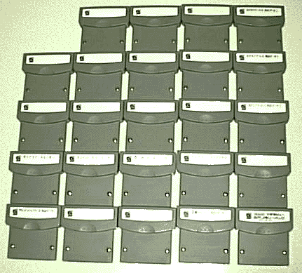
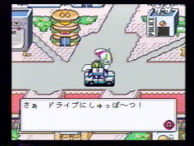
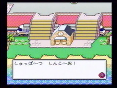
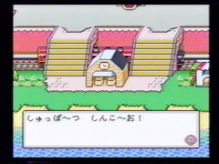
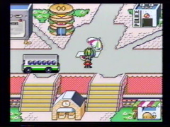
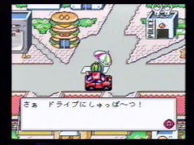
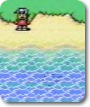
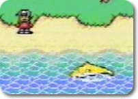
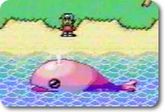

# Items & Mechanics

{ align="right" width="250" }

## Memory Pack System

The **Memory Pack** (1 megabit / 128KB flash RAM) was the physical storage medium for all Satellaview content. It plugged into the BS-X cartridge and stored:[^1]

- Downloaded games
- Save data
- System configuration
- Broadcast schedules

The Memory Pack used a combination of flash memory (for game storage) and battery-backed SRAM (for save data). This dual approach was necessary because flash memory was still relatively new and expensive for consumer devices in 1995.[^2]

## Download Mechanics

Games and content were broadcast during specific time windows. The player navigated the BS-X town to the **Download Center** where they could:[^3]

- Browse available broadcasts (current and upcoming)
- Initiate downloads during broadcast windows
- View download progress and completion status
- Launch downloaded games

Downloads were transmitted as part of the St.GIGA satellite signal. The BS-X cartridge contained the necessary decryption and decoding logic to convert the satellite data into usable game content.[^4]

## The Avatar System

The player avatar chosen in BS-X served as a **persistent character** that carried into many broadcast games. This was a unique feature for its time:[^5]

- The avatar's appearance (male or female) was determined by gender selection
- The avatar's name was set during initial configuration
- Supported games would read the avatar data from the Memory Pack
- Not all broadcast games supported this feature

## BS-X Items

The BS-X town featured various interactive items that could be found and sometimes purchased. Below are items documented by Satellaview Heaven:

{ width="150" } { width="150" } { width="150" }

{ width="150" } { width="150" } { width="150" }

{ width="150" } { width="150" }

These items were likely used in the town for transportation or decoration purposes, though the exact mechanics of many items remain undocumented.

## Broadcast Schedules

The BS-X town displayed current and upcoming broadcast schedules through various means:[^6]

- **Fortune Teller NPC** -- Provided broadcast schedule information
- **Bulletin Boards** -- Displayed current and upcoming broadcasts
- **Kabe Shinbun** -- Wall newspaper with news and game information
- **In-town NPCs** -- Some characters provided scheduling hints

## Memory / Save Management

The Memory Pack had limited capacity (128KB). Players needed to manage their storage by:[^7]

- Deleting old games to make room for new downloads
- Deciding which save data to retain
- Removing magazines and other non-game content

---

[^1]: [Elude Visibility - GK Writer Documentation](https://eludevisibility.org/gk-writer-gk-terminal-np-carts-sales-sheet)
[^2]: [Super Famicom Wiki - Memory Pack](https://wiki.superfamicom.org/satellaview)
[^3]: [BS-X Project](https://project.satellaview.org/)
[^4]: [LuigiBlood - Satellaview technical docs](https://wiki.superfamicom.org/satellaview)
[^5]: [BS Zelda Shrine - BS-X Page](http://bszelda.zeldalegends.net/bsx.shtml)
[^6]: [Satellaview History Museum](https://web.archive.org/web/*/http://www.f3.dion.ne.jp/~kameb/satella/satella.htm)
[^7]: [Japanese Satellaview Wiki](https://web.archive.org/web/*/http://www36.atwiki.jp/bsxx)
